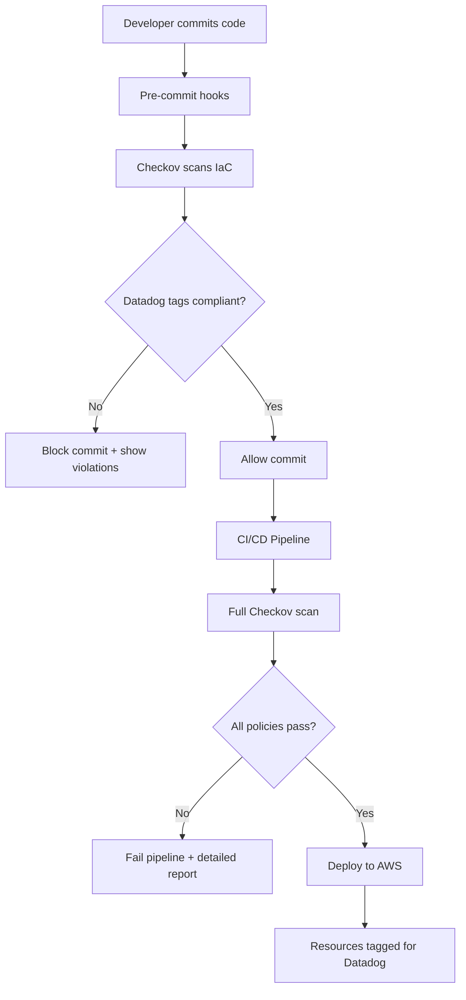

# 🐕 Datadog IaC Tagging Compliance Tool

A comprehensive Infrastructure as Code (IaC) scanning solution that ensures 100% Datadog tagging compliance across your AWS resources. This tool demonstrates how static analysis can prevent tagging issues before deployment, enabling seamless Datadog observability.

## 🎯 What This Solves

**The Problem**: Inconsistent or missing resource tags lead to:
- Poor observability in Datadog UI
- Ineffective Watchdog anomaly detection  
- Broken APM service mapping
- Difficult log correlation and filtering
- Incomplete RUM and Kubernetes monitoring

**The Solution**: Automated IaC scanning that enforces Datadog tagging standards at the CI/CD pipeline level, ensuring every resource is properly tagged before deployment.

## 📋 Required Datadog Tags

This tool enforces four critical tags on all AWS resources:

| Tag | Purpose | Example Values | Datadog Benefit |
|-----|---------|----------------|-----------------|
| `env` | Environment identification | `prod`, `staging`, `dev`, `test` | Environment filtering, separate dashboards |
| `service` | Service/application name | `web-api`, `user-service`, `payment-gateway` | APM service mapping, distributed tracing |
| `version` | Application/deployment version | `1.2.3`, `v2.0.1`, `main` | Deployment tracking, version comparison |
| `team` | Owning team/department | `backend-team`, `data-team`, `platform-team` | Ownership tracking, alert routing |

## 🏗️ Architecture Overview



## 🛠️ Quick Start

### Option 1: Docker (Recommended for Demos) 🐳

```bash
# Using Make (easiest)
make demo              # Interactive customer demo
make quick-scan        # Fast compliance check
make shell             # Explore the container

# Or using Docker Compose directly  
docker-compose run datadog-iac-scanner ./scripts/demo-runner.sh
docker-compose run datadog-iac-scanner ./scripts/quick-scan.sh
docker-compose run datadog-iac-scanner bash
```

**Why Docker for Customer Demos?**
- ✅ Zero local dependency installation
- ✅ Consistent environment across all systems  
- ✅ No Python/Checkov version conflicts
- ✅ Works on any laptop (Windows/Mac/Linux)
- ✅ Easy cleanup after demos
- ✅ Professional, repeatable demonstrations

### Option 2: Local Installation

```bash
# Install Python requirements
pip install -r requirements.txt

# Run the Datadog tag compliance checker
./scripts/datadog-tag-check.sh

# Or run Checkov directly with custom policies
checkov --framework terraform \
        --directory ./terraform \
        --external-checks-dir ./policies \
        --soft-fail
```

### 3. See the Results

The scan will identify:
- ✅ **Compliant resources** with all required Datadog tags
- 🚨 **Non-compliant resources** missing tags or with invalid formats
- ⚠️ **Partially compliant** resources with formatting issues

## 📁 Project Structure

```
📦 datadog-iac-tagging-tool/
├── 📂 .github/workflows/          # CI/CD pipeline configuration
│   └── iac-scanning.yml           # GitHub Actions workflow
├── 📂 policies/                   # Custom Checkov policies
│   ├── required_tags_policy.py    # Python-based Datadog tag policy
│   ├── data_classification_policy.py  # Data handling compliance
│   └── tagging_policy.yaml        # YAML-based policies
├── 📂 terraform/                  # Example infrastructure
│   ├── main.tf                    # Mix of compliant/non-compliant resources
│   ├── variables.tf               # Input variables
│   └── outputs.tf                 # Resource outputs
├── 📂 scripts/                    # Utility scripts
│   └── datadog-tag-check.sh       # Compliance checker script
├── .pre-commit-config.yaml        # Pre-commit hook configuration
├── requirements.txt               # Python dependencies
└── README.md                      # This file
```

## 🔍 Demo Scenarios

### Scenario 1: Compliant Resource
```hcl
resource "aws_instance" "web_server_compliant" {
  ami           = "ami-0c02fb55956c7d316"
  instance_type = "t3.micro"
  
  tags = {
    Name    = "web-server-prod"
    env     = "prod"                 # ✅ Valid environment
    service = "web-server"           # ✅ Valid service name
    version = "1.2.3"               # ✅ Semantic version
    team    = "platform-team"       # ✅ Valid team name
  }
}
```

**Result**: ✅ Passes all Datadog tag compliance checks

### Scenario 2: Non-Compliant Resource
```hcl
resource "aws_instance" "web_server_non_compliant" {
  ami           = "ami-0c02fb55956c7d316"
  instance_type = "t3.micro"
  
  tags = {
    Name = "web-server-dev"
    # Missing ALL required Datadog tags!
  }
}
```

**Result**: 🚨 Fails with "Missing required Datadog tags: env, service, version, team"

### Scenario 3: Invalid Tag Formats
```hcl
resource "aws_rds_instance" "database_partial" {
  # ... resource configuration ...
  
  tags = {
    Name    = "company-database"
    env     = "dev"                    # ✅ Valid
    service = "Database_Service"       # ❌ Contains uppercase/underscore
    version = "latest-v1"             # ❌ Invalid format
    team    = "Backend Team"          # ❌ Contains space
  }
}
```

**Result**: ⚠️ Fails with specific format violation details

## 🚀 CI/CD Integration

### GitHub Actions Workflow

The included `.github/workflows/iac-scanning.yml` provides:

1. **Terraform Validation**: Ensures code is syntactically correct
2. **Checkov Security Scan**: Runs all security and tagging policies  
3. **Compliance Reporting**: Detailed results in SARIF format
4. **PR Comments**: Automatic feedback on pull requests
5. **Artifact Upload**: Scan results for review

### Pre-commit Hooks

The `.pre-commit-config.yaml` enables:
- Terraform formatting and validation
- Checkov scanning on every commit
- Python policy linting
- YAML validation

## 📊 Sample Output

When scanning the demo infrastructure, you'll see:

```
🐕 DATADOG TAG COMPLIANCE CHECKER
==================================

🔍 Running Checkov scan with Datadog tag policies...

📊 SCAN RESULTS SUMMARY
=======================
✅ Total checks run: 45
✅ Passed checks: 38
❌ Failed checks: 7
🏷️ Datadog tag violations: 4

🚨 DATADOG TAG COMPLIANCE ISSUES:
----------------------------------------
  📄 terraform/main.tf
     Resource: aws_instance.web_server_non_compliant
     Issue: Resource is missing all tags. Required Datadog tags: env, service, version, team

  📄 terraform/main.tf  
     Resource: aws_s3_bucket.logs_bucket_non_compliant
     Issue: Missing required Datadog tags: env, service, version, team

💡 REQUIRED DATADOG TAGS:
  • env: Environment (prod, staging, dev, test)
  • service: Service name (lowercase-with-hyphens)
  • version: Version (semantic versioning or branch)
  • team: Owning team (lowercase-with-hyphens)

🎯 WHY THESE TAGS MATTER:
  • Enable seamless Datadog UI navigation
  • Improve Watchdog anomaly detection
  • Enhance APM service mapping  
  • Better log correlation and filtering
  • Effective RUM and K8s monitoring
```

## 🔧 Customization

### Adding New Resource Types

Edit `policies/required_tags_policy.py` and add resource types to the `supported_resources` list:

```python
supported_resources = [
    "aws_instance",
    "aws_s3_bucket",
    # Add new resource types here
    "aws_dynamodb_table",
    "aws_sqs_queue",
    "aws_sns_topic"
]
```

### Modifying Tag Requirements

Update the validation logic in `scan_resource_conf()` method:

```python
# Add custom validation for new tags
if "cost_center" in tags:
    cost_center = str(tags["cost_center"])
    if not cost_center.isdigit():
        violations.append("Cost center must be numeric")
```

### Environment-Specific Rules

Create separate policy files for different environments or use conditional logic:

```python
def __init__(self):
    # Different rules for production vs development
    if os.getenv('ENVIRONMENT') == 'production':
        self.required_tags.append('compliance_level')
```

## 📈 Production Deployment

### Phase 1: Soft Enforcement (Recommended Start)
- Deploy with `--soft-fail` mode
- Generate reports and educate teams
- Fix existing violations gradually

### Phase 2: Hard Enforcement
- Switch to `--hard-fail-on CKV_DD_TAGS_001`  
- Block deployments with tag violations
- Ensure 100% compliance

### Example Production Pipeline

```yaml
- name: Enforce Datadog Tag Compliance
  run: |
    checkov \
      --framework terraform \
      --directory ./terraform \
      --external-checks-dir ./policies \
      --check CKV_DD_TAGS_001 \
      --hard-fail-on CKV_DD_TAGS_001
```

## 🎯 Datadog Benefits Achieved

Once all resources are properly tagged, customers will experience:

### 🎨 **Enhanced UI Navigation**
- Filter resources by environment, service, or team
- Quick service health overview
- Streamlined troubleshooting workflow

### 🤖 **Improved Watchdog Detection**  
- Better anomaly detection with service context
- Reduced false positives through proper grouping
- Faster incident response with clear ownership

### 🔍 **Superior APM Performance**
- Automatic service mapping and dependency visualization
- Accurate distributed tracing across services
- Version-specific performance analysis

### 📊 **Better Log Management**
- Precise log filtering and correlation
- Service-specific log analysis
- Environmental log segregation

### 📱 **Complete RUM Coverage**
- Frontend performance tracking by version
- User experience monitoring per environment
- Team-based alert routing

### ☸️ **Full Kubernetes Observability**
- Pod-level tagging inheritance
- Service mesh visibility
- Container performance tracking

## 🆘 Troubleshooting

### Common Issues

**Q: Checkov not finding custom policies**
```bash
# Ensure policies directory is correct
checkov --external-checks-dir ./policies --list
```

**Q: Pre-commit hooks not running**
```bash
# Reinstall hooks
pre-commit clean
pre-commit install
pre-commit run --all-files
```

**Q: False positives on valid tags**
```bash
# Check tag formatting requirements
# - Use lowercase letters, numbers, and hyphens only
# - No spaces or special characters
# - Follow semantic versioning for version tags
```

## 🎭 TAM Demo Workflow

### Perfect Customer Demo Flow

**One-Time Setup (3 minutes)**
```bash
git clone <this-repo>
cd testingiacscanningtagtool
./quick-setup.sh  # Builds everything and optionally starts demo
```

**Or Manual Setup**
```bash
git clone <this-repo>
cd testingiacscanningtagtool
make demo  # Builds container and runs interactive demo
```

**Demo Script (10-15 minutes)**

1. **🎯 Set the Stage** (2 mins)
   - "Let me show you a common customer problem..."
   - Explain the pain of missing/inconsistent tags in Datadog
   - Show how this impacts Watchdog, APM, logs, and UI navigation

2. **🚨 Show the Problem** (3 mins)
   ```bash
   make show-terraform  # Shows compliant vs non-compliant resources
   ```
   - Point out missing `env`, `service`, `version`, `team` tags
   - Explain each tag's purpose for Datadog observability

3. **🔍 Demonstrate the Solution** (5 mins)
   ```bash
   make quick-scan      # Shows violations in real-time
   ```
   - Live scan identifies all tagging issues
   - Point out specific violation details
   - Show validation rules (lowercase, semantic versioning, etc.)

4. **⚙️ Explain Implementation** (3 mins)
   ```bash
   make info           # Shows CI/CD integration files
   ```
   - Pre-commit hooks catch issues locally
   - CI/CD pipeline prevents bad deployments
   - Start with soft-fail, evolve to hard-fail

5. **✅ Show the Benefits** (2 mins)
   - Perfect Datadog UI navigation
   - Enhanced Watchdog anomaly detection
   - Better APM service mapping
   - Improved log correlation
   - Complete observability coverage

### Key Demo Messages

- **Before IaC Scanning**: "Resources deployed without proper tags break Datadog observability"
- **With IaC Scanning**: "Every resource is guaranteed to have perfect Datadog tags"
- **Customer Value**: "100% tagging compliance = 100% observability coverage"

### Customization for Customer

```bash
# Show how to customize for their tags
make shell
# Edit policies/required_tags_policy.py
# Add their specific tag requirements
# Demo the customized scan
```

## 📊 Complete Solution Summary

### What You've Built

✅ **Comprehensive IaC Scanning Solution**
- Custom Checkov policies for Datadog tagging
- Python and YAML policy formats
- Terraform examples (compliant and non-compliant)
- Docker containerization for portability

✅ **Production-Ready CI/CD Integration**
- GitHub Actions workflow with SARIF reporting
- Pre-commit hooks for early detection
- Configurable soft-fail vs hard-fail modes
- Automated PR commenting with results

✅ **Professional Demo Tools**
- Interactive demo script for customers
- Quick scan for fast demonstrations
- Makefile with simple commands
- Zero-dependency Docker setup

✅ **Enterprise Features**
- Tag format validation (lowercase, semantic versioning)
- Environment-specific rules
- Detailed violation reporting
- JSON output for automation

### Files Created/Modified

| File | Purpose |
|------|---------|
| `Dockerfile` | Containerized scanning environment |
| `docker-compose.yml` | Multi-service orchestration |
| `Makefile` | Simplified command interface |
| `policies/required_tags_policy.py` | Custom Datadog tagging policy |
| `policies/tagging_policy.yaml` | YAML-based policy definitions |
| `terraform/main.tf` | Demo resources (compliant + non-compliant) |
| `.github/workflows/iac-scanning.yml` | CI/CD pipeline |
| `.pre-commit-config.yaml` | Pre-commit hook configuration |
| `scripts/demo-runner.sh` | Interactive customer demo |
| `scripts/quick-scan.sh` | Fast compliance check |
| `README.md` | Complete documentation |

### Ready for Customer Environments

This solution is immediately deployable and customizable for any customer environment. It demonstrates the complete IaC scanning workflow from development to production deployment.

## 📞 Support & Next Steps

**For Customer Demos:**
1. Clone this repository
2. Run `make demo` for interactive demonstration  
3. Customize policies for customer-specific tags
4. Show CI/CD integration capabilities
5. Discuss implementation timeline

**For Implementation:**
1. Install Checkov in customer environment
2. Adapt policies for their tag requirements
3. Integrate into their CI/CD pipelines
4. Start with warnings, evolve to blocking
5. Achieve 100% Datadog tagging compliance

---

**🐕 Built for Datadog Technical Account Managers**  
*Showcase the power of proactive IaC scanning for perfect observability*

🔗 **Learn More**: [Datadog Tagging Best Practices](https://docs.datadoghq.com/tagging/)

---

*This enterprise-ready solution can be customized for any customer environment and scaled across their entire infrastructure pipeline.*
